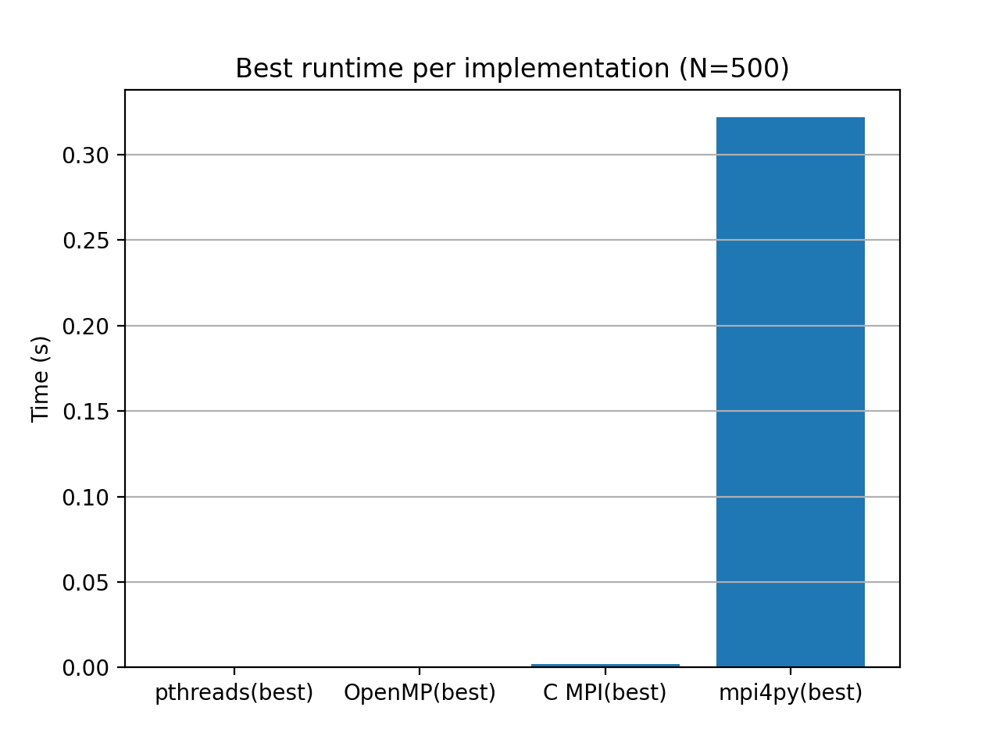
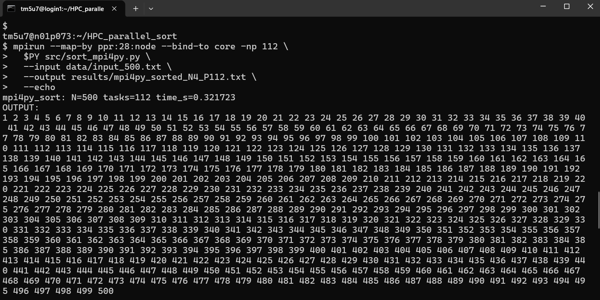

# HPC Parallel Sorting


## Overview

This project presents a comprehensive implementation and performance evaluation of parallel sorting algorithms using multiple parallel programming paradigms.  
The objective is to analyze scalability, efficiency, and runtime behavior across **shared-memory** and **distributed-memory** models on a real high-performance computing (HPC) system.

All implementations were executed and benchmarked on the **SPbPU supercomputer (Tornado cluster)**, providing realistic performance measurements beyond theoretical analysis or local-machine testing.

---


## Preview

The figure below compares the **best runtime achieved by each implementation**
for an input size of **N = 500**, measured from real executions on the
**SPbPU Tornado supercomputer**.

<p align="center">
  
  <br>
  <em>Best runtime per implementation (N = 500)</em>
</p>

As expected, shared-memory C implementations (Pthreads and OpenMP)
achieve the lowest runtimes due to minimal communication overhead,
while mpi4py exhibits higher execution time because of Python-level
overhead and inter-process communication costs.


## Table of Contents
- [Implemented Approaches](#implemented-approaches)
- [Project Structure](#project-structure)
- [Experimental Setup](#experimental-setup)
- [Execution Configuration (SPbPU Tornado)](#execution-configuration-spbpu-tornado)
- [How to Run](#how-to-run)
- [Results](#results)
- [Performance Plots](#performance-plots)
- [Academic Context](#academic-context)


## Implemented Approaches

The following parallel programming models are implemented and analyzed:

- **MPI (C)**  
  Distributed-memory parallel sorting using message passing across multiple processes.

- **OpenMP (C)**  
  Shared-memory parallel sorting using compiler-assisted multithreading.

- **POSIX Threads (Pthreads, C)**  
  Low-level shared-memory parallel sorting with explicit thread management.

- **mpi4py (Python)**  
  Python-based distributed parallel sorting using MPI bindings.

---

## Project Structure

```
├── src/        # Source code (C and Python implementations)
├── data/       # Input datasets
├── results/    # Raw output files from real executions
├── plots/      # Performance plots and visualizations
├── assets/     # Supplementary figures and illustrations
├── slurm/      # Optional Slurm batch scripts
├── Makefile    # Build automation
└── Report.pdf  # Detailed analysis and discussion
```
---


## Experimental Setup

- **Platform:** SPbPU High-Performance Computing System (Tornado)
- **Programming Languages:** C, Python
- **Parallel Models:** MPI, OpenMP, Pthreads
- **Evaluation Metrics:**
  - Execution time
  - Speedup
  - Scalability
  - Comparative performance across models

Benchmarks were conducted with varying numbers of threads and MPI processes to evaluate parallel efficiency and scalability behavior.

---

## Execution Configuration (SPbPU Tornado)

All benchmarks and result files in this repository were obtained from **real executions on the SPbPU Tornado supercomputer**, primarily using **interactive Slurm sessions**.  
The files stored in the `results/` directory correspond to actual runs performed on the cluster.

### 1. C + Pthreads (Shared Memory)

- **Execution model:** Shared memory (single node)
- **Nodes:** 1
- **Processes:** 1
- **Threads:** 1, 2, 4, 8, 14, 28
- **Parallelization control:** Manual thread creation via `pthread_create`
- **Execution environment:** Single Tornado compute node

### 2. C + OpenMP (Shared Memory)

- **Execution model:** Shared memory (single node)
- **Nodes:** 1
- **Processes:** 1
- **Threads:** 1, 2, 4, 8, 14, 28
- **Parallelization control:** `OMP_NUM_THREADS` environment variable
- **Execution environment:** Single Tornado compute node

### 3. C + MPI (Distributed Memory)

- **Execution model:** Distributed memory (MPI)

| Nodes | Tasks per node | Total MPI ranks |
|------:|---------------:|----------------:|
| 1     | 28             | 28              |
| 4     | 28             | 112             |
| 8     | 28             | 224             |

- **Example execution command:**
```bash
srun -N 4 -n 112 ./sort_mpi

```
### 4. Python + mpi4py (Distributed Memory)

- **Execution model:** Distributed memory (MPI with Python)

| Nodes | Tasks per node | Total MPI ranks |
|------:|---------------:|----------------:|
| 4     | 28             | 112             |
| 8     | 28             | 224             |

- **Example execution command:**
```bash
mpirun -np 112 python sort_mpi4py.py
```


## Running on HPC (Slurm – Optional Batch Mode)

The original benchmarks were performed using **interactive Slurm sessions** on the Tornado cluster.  
For completeness and reproducibility, example **batch-mode Slurm scripts** are provided as an **optional** execution method.

```bash
sbatch slurm/run_mpi.sbatch
sbatch slurm/run_openmp.sbatch
sbatch slurm/run_pthreads.sbatch
```
---

## Execution Evidence (Real HPC Runs)

The following screenshots demonstrate **real executions** of the implemented
parallel sorting algorithms on the **SPbPU Tornado supercomputer**.
These are **not simulated results** and were obtained directly from interactive
and multi-node HPC sessions.

### Pthreads Execution (Shared Memory)

- Single compute node
- Manual thread creation via `pthread_create`
- Thread counts: 1, 2, 4, 8, 14, 28


---

### OpenMP Execution (Shared Memory)

- Single compute node
- Thread control via `OMP_NUM_THREADS`
- Thread counts: 1, 2, 4, 8, 14, 28


---

### MPI Execution – Single Node

- Distributed-memory model
- MPI ranks running on a single node


---

### MPI / mpi4py Execution – Multi Node

- Multi-node distributed execution on Tornado
- 4–8 nodes, up to 224 MPI ranks
- Python-based MPI using `mpi4py`




## Results

The results demonstrate clear performance differences between threading-based and message-passing approaches, highlighting the impact of communication overhead, memory access patterns, and scalability limits of each model.

Detailed numerical results and performance plots are available in:
- `results/`
- `plots/`
- `Report.pdf`

## Performance Plots

### Execution Time


### Speedup


The plots illustrate improved scalability for MPI at higher process counts, 
while OpenMP and Pthreads exhibit saturation due to shared-memory limitations.

---


## Academic Context

This project was developed as part of coursework and practical training in **High-Performance Computing**
 at Saint Petersburg Polytechnic University (SPbPU).


---


## Author

**Matin Dastanboo**


MSc Student – Artificial Intelligence & Machine Learning 

Peter the Great St. Petersburg Polytechnic University

SAINT PETERSBURG - RUSSIA


